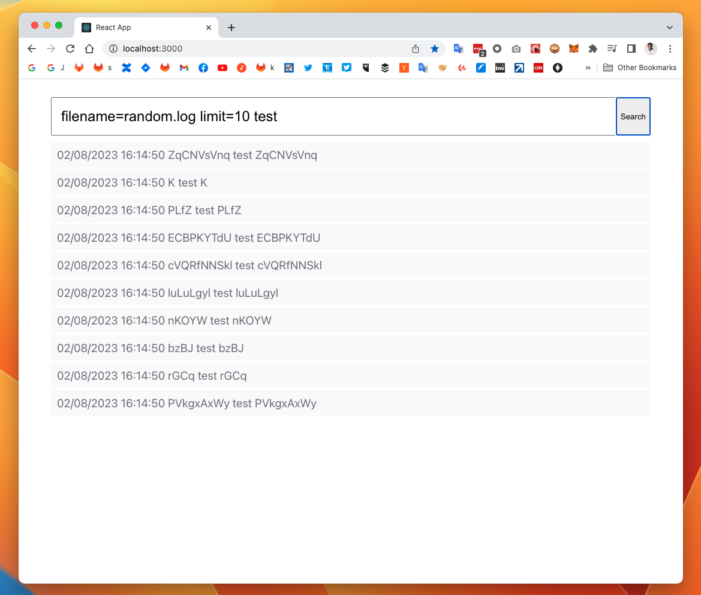

# SearchHead

This server is the front-end. This frontend server send the backend ([VarLogSearch(Python)](https://github.com/sakaijunsoccer/varlogsearch)/[VarLogSearchJs(Node.js)](https://github.com/sakaijunsoccer/varlogsearchjs)) with the file name in /var/log, the search keyword and the number of detected loglines, and the backend ([VarLogSearch(Python)](https://github.com/sakaijunsoccer/varlogsearch)/[VarLogSearchJs(Node.js)](https://github.com/sakaijunsoccer/varlogsearchjs)) returns the most recent loglines found in the search. This front-end server will be a demo application for displaying logs found by search keywords from var log.


## QuickStart

#### Install node, npm
```
$ curl -o- https://raw.githubusercontent.com/nvm-sh/nvm/v0.39.3/install.sh | bash
$ nvm --version
0.39.3
$ nvm install 18.12.1
$ npm --version
8.19.2
```

#### Install package
```
$ npm install
```

#### Run on local

Follow the document below to start the backup server on port 8080.<br />
[VarLogSearch(Python)](https://github.com/sakaijunsoccer/varlogsearch/)
or 
[VarLogSearchJS(Node.js)](https://github.com/sakaijunsoccer/varlogsearchjs/)

Start the server with the command below
```
npm start
```
Please go to http://0.0.0.0:3000. You could see the UI look like



#### Test
```
npm test
```
